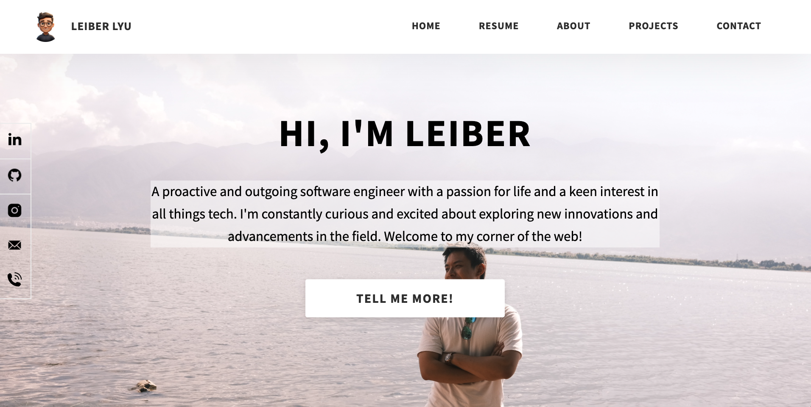

# PersonalWeb2.0

## WebSite Link

- ### www.leiberlyu.com

## Overview

This is the upgraded version of the [automated personal website solution](https://github.com/Leiber-CivilComEngineer/Jenkins-Sonarqube-Docker-AWS). The project uses Node.js to manage the runtime environment, Express as the web application framework, and PM2 to manage Node processes. The code is automatically deployed on an AWS EC2 virtual server via GitHub Actions, with AWS Route 53 directing access to the personal domain (www.leiberlyu.com) to the EC2 server hosting the web service. The project is still being updated to add more new features in the area of automated integration and deployment.

## How to run

- npm start server.js

## Website ScreenShot

